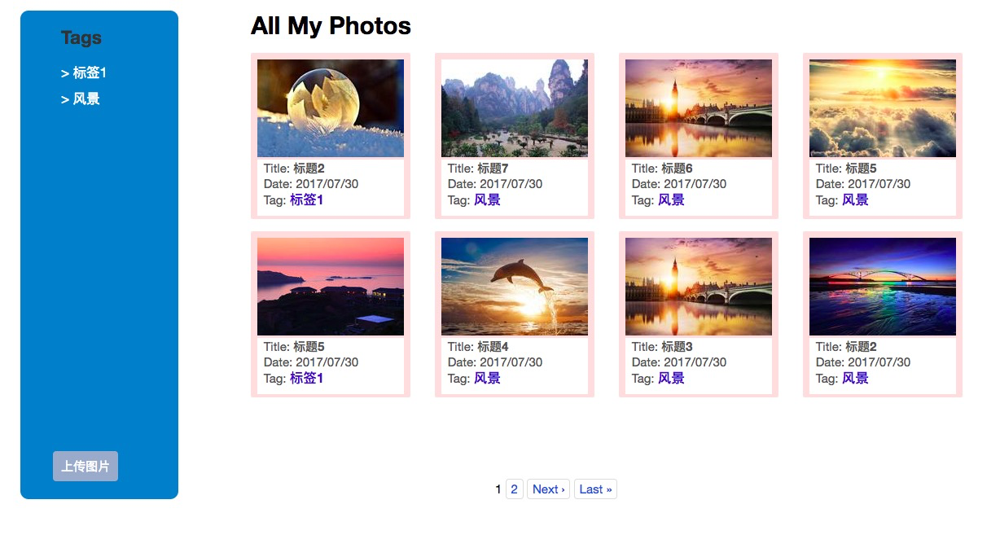

## Sample images gallery [http://gallery.timlentse.com](http://gallery.timlentse.com)

### What it looks

### 使用到的技术栈

  * [Rails(5.1.2)](https://github.com/rails/rails)

  * [jQuery](https://jquery.com/) & [jQuery UI](https://jqueryui.com/)(元素拖动)

  * [kaminari](https://github.com/kaminari/kaminari)(ajax翻页)

  * [qiniu](https://github.com/qiniu/ruby-sdk)(图片存储, 采用js 直传, ruby-sdk用于生成token)

  * [settingslogic](https://github.com/binarylogic/settingslogic)(配置文件)

  * [capistrano](https://github.com/capistrano/capistrano)(用于程序部署)

### 网站架构

  * [Rails(5.1.2)](https://github.com/rails/rails)

  * [Puma](https://github.com/puma/puma)(app后端服务器) 

  * [SQLite](https://www.sqlite.org/)(后端数据库存储)

  * [Nginx](https://nginx.org/en/)(反向代理服务器)

### Features

  * 图片上传

  * Ajax 翻页

  * 点击标签可动态修改图片标签

  * 通过拖动图片动态修改图片标签

